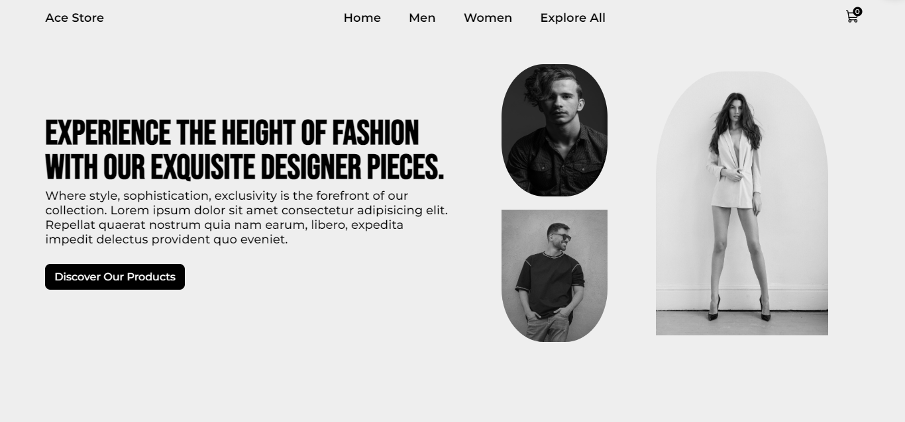
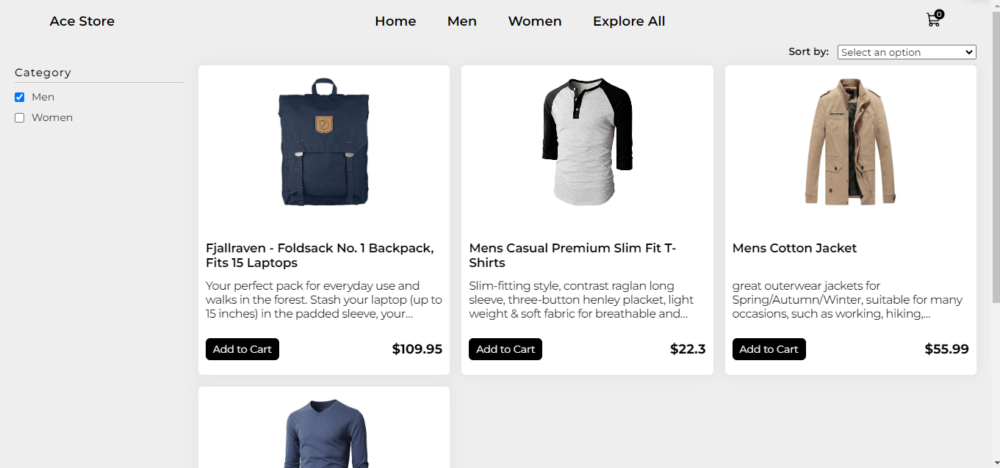
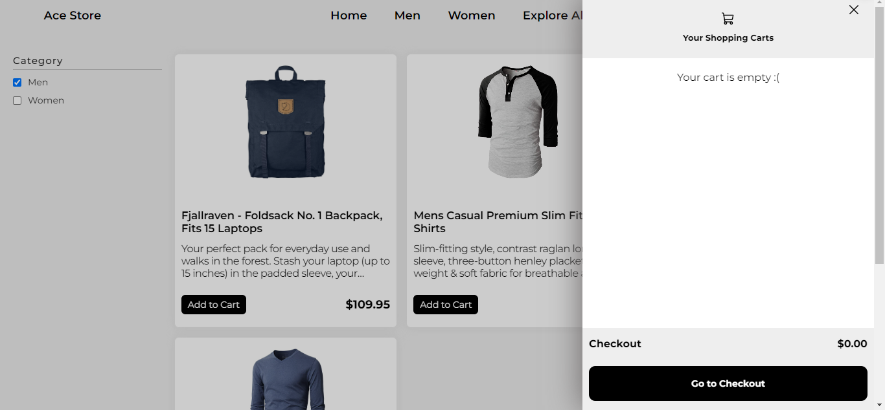
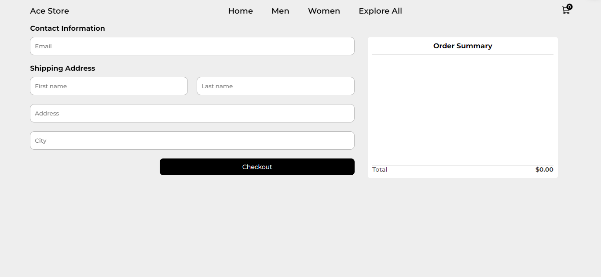
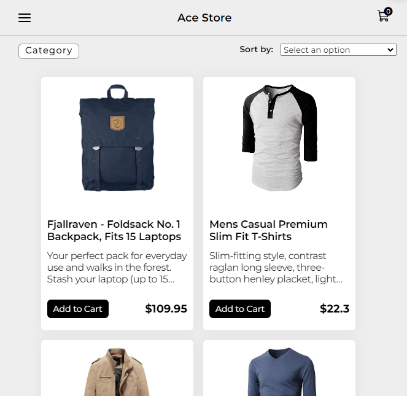

# Ace Clothing | Clothing Ecommerce Website

Ace Clothing is a project built using React js. Users can explore products, browse according to category, sort item on the basis of price, add or remove products from cart, adjust item quantities and see real time price update.

**Try it:** https://ace-clothing.netlify.app/

## Pages

- Home page
- Explore page
- Checkout Page.

### Npm

- To install packages `npm install` after that to run the project `npm start`

(The home page design is from [this dribble](https://dribbble.com/shots/20628601-Clothing-Website-Concept))
